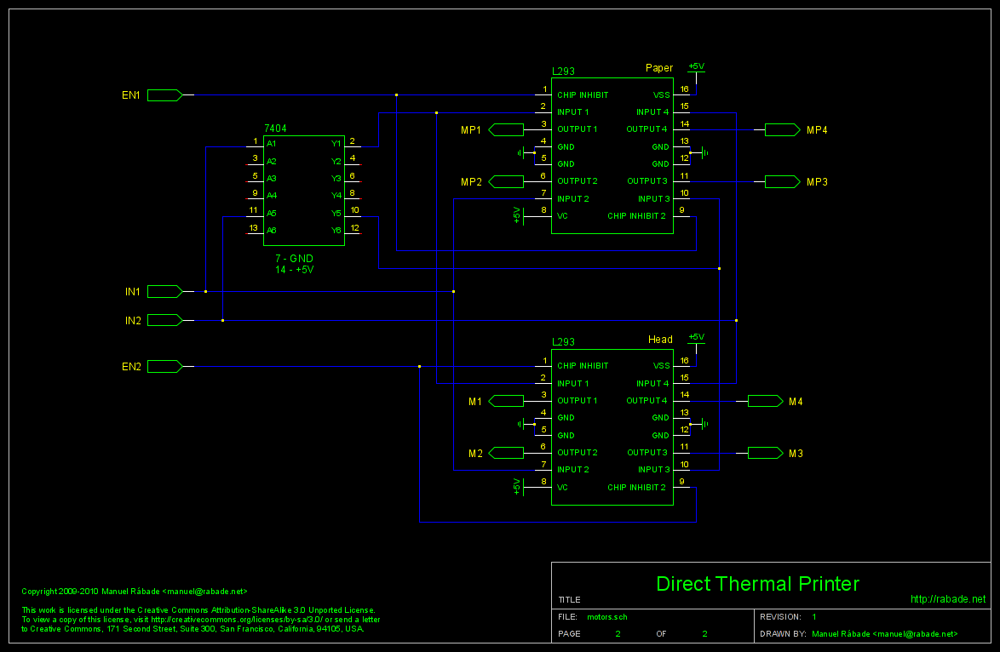
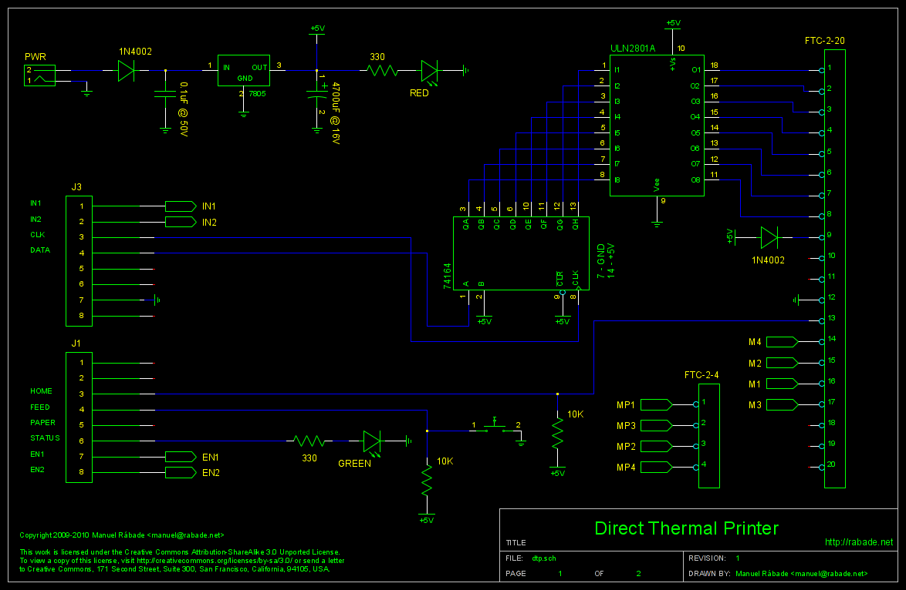

Impresora Térmica
=================

Este proyecto implementa una impresora térmica controlada por un
[Arduino](http://arduino.cc) alrededor del módulo de impresión
[Panasonic EPT-1019HW2](doc/EPT-1019HW2.pdf).

El módulo de impresión utiliza papel térmico de 2" (58 mm) y tiene una
resolución horizontal de 96 puntos. Este proyecto incluye una
tipografía de 6x8 puntos que permite imprimir 32 caracteres por linea.

Prototipo
---------


También puedes ver el [video de la impresora térmica en
funcionamiento](http://vimeo.com/13995215).

Esquemáticos
------------

Dibujados con [gschem](http://www.gpleda.org) 1.6:

[sch/motors.sch](sch/motors.sch) - Sección de potencia y control para
los motores a pasos.



[sch/dtp.sch](sch/dtp.sch) - Fuente de poder; sección de potencia y
control para el cabezal térmico; conexiones con Arduino y módulo
Panasonic; botones y leds.



Firmware
--------

Para Arduino 0018:

[sketch/DTP/Conf.h](sketch/DTP/Conf.h) - Definición de puertos y
características mecánicas del módulo de impresión.

[sketch/DTP/Font.h](sketch/DTP/Font.h) - Definición de la tipografía.

[sketch/DTP/DTP.pde](sketch/DTP/DTP.pde) - Código fuente del firmware.

### Mecánica del módulo de impresión

Cada punto de impresión, vertical u horizontal, corresponde a dos pasos
del motor correspondiente. Los limites del módulo de impresión
expresados en pasos de motor son:

```
3     5     68                                                      384
|.....|.....|.........................................................|
 home  head  min                                                   max
       park
```

### Tipografía

Los caracteres están indexados por su código ASCII y codificados en 5
bytes que corresponden a los puntos de cada columna. Por
ejemplo, la definición para la letra A con índice 97 es:

`#define FT97  0x1F, 0x24, 0x44, 0x24, 0x1F`

Y en puntos impresos corresponde a:

```       
MSB  .....
     ..X..
     .X.X. 
     X...X
     X...X
     XXXXX
     X...X
LSB  X...X
```

Al momento de imprimir se agrega automáticamente a la derecha una
columna en blanco para separar los caracteres y así tenemos una
tipografía de 6x8 puntos.

### Interfaz

La comunicación con la impresora es vía serial a 9600 bps y los
comandos disponibles son:

**Acciones básicas**

```
   p - Head park
   u - Head up
   m - Head max
   r - Head return
   f - Paper forward
   e - Paper feed
   s - Status
```

**Pruebas**

```
   x - Basic
   y - Graphics
   z - Typography
```

**Modo de operación**

```
   a - ASCII
   b - Binary
```

El modo ASCII tiene un buffer de 32 caracteres que corresponden a una
linea. Para cancelar la linea y regresar al modo comando enviar ESC
(0x1B).

Autor
-----

Manuel Rábade <[manuel@rabade.net](mailto:manuel@rabade.net)>

Licencia
--------

Esta obra está bajo una [licencia de Creative Commons
Reconocimiento-CompartirIgual 4.0
Internacional](http://creativecommons.org/licenses/by-sa/4.0/).
