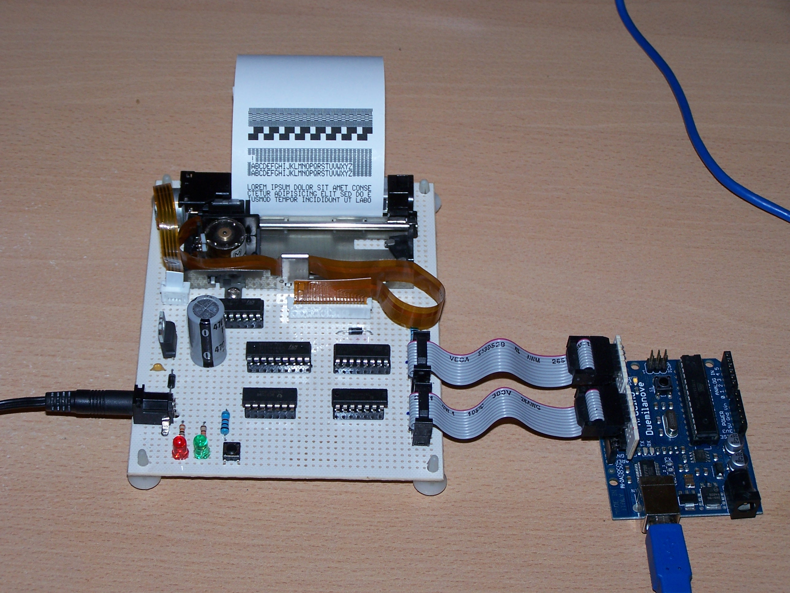

Thermal Printer
=================

This project implements a thermal printer controlled by a
[Arduino](http://arduino.cc) around the printing module
[Panasonic EPT-1019HW2](doc/EPT-1019HW2.pdf) (in original work, will replace /w something like [LTP3445](http://zival.ru/sites/default/files/download/ltp3445.pdf)).

[info i will use](http://zival.ru/content/printsip-raboty-termopechatayushchei-golovki)
------ i will update it later

The printing module uses 2" (58 mm) thermal paper and has a
96-point horizontal resolution. This project includes a
typography of 6x8 points that allows printing 32 characters per line.

Prototype
---------



You can also see the [video de la impresora térmica en
funcionamiento](http://vimeo.com/13995215).

Schematic
------------

Drawn with [gschem](http://www.gpleda.org) 1.6:

[sch/motors.sch](sch/motors.sch) - Power and control section for
the motors step by step.


[sch/dtp.sch](sch/dtp.sch) - Power supply; power section and
control for the thermal head; connections with Arduino and module
Panasonic; buttons and LEDs.


Firmware
--------

For Arduino 0018:

[sketch/DTP/Conf.h](sketch/DTP/Conf.h) - Definition of ports and
mechanical characteristics of the printing module.

[sketch/DTP/Font.h](sketch/DTP/Font.h) - Definition of typography.

[sketch/DTP/DTP.pde](sketch/DTP/DTP.pde) - Firmware source code.

### Mechanics of the printing module

Each print point, vertical or horizontal, corresponds to two steps
of the corresponding engine. The limits of the printing module
Expressed in motor steps are:

```
3     5     68                                                      384
|.....|.....|.........................................................|
 home  head  min                                                   max
       park
```

### Typography

The characters are indexed by their ASCII code and encoded in 5
bytes that correspond to the points of each column. By
For example, the definition for letter A with index 97 is:

`#define FT97  0x1F, 0x24, 0x44, 0x24, 0x1F`

And in printed points corresponds to:

```       
MSB  .....
     ..X..
     .X.X. 
     X...X
     X...X
     XXXXX
     X...X
LSB  X...X
```

At the time of printing, a new copy is automatically added to the right.
blank column to separate the characters and so we have a
typography of 6x8 points.

### Interface

The communication with the printer is via serial at 9600 bps and the
Available commands are:

** Basic actions **

```
   p - Head park
   u - Head up
   m - Head max
   r - Head return
   f - Paper forward
   e - Paper feed
   s - Status
```

**Tests**

```
   x - Basic
   y - Graphics
   z - Typography
```

**Operation mode**

```
   a - ASCII
   b - Binary
```

The ASCII mode has a buffer of 32 characters corresponding to one
line. To cancel the line and return to send command mode ESC
(0x1B).

Autor
-----

Manuel Rábade <[manuel@rabade.net](mailto:manuel@rabade.net)>

License
--------

This work is published under a [licencia de Creative Commons
Reconocimiento-CompartirIgual 4.0
Internacional](http://creativecommons.org/licenses/by-sa/4.0/).
